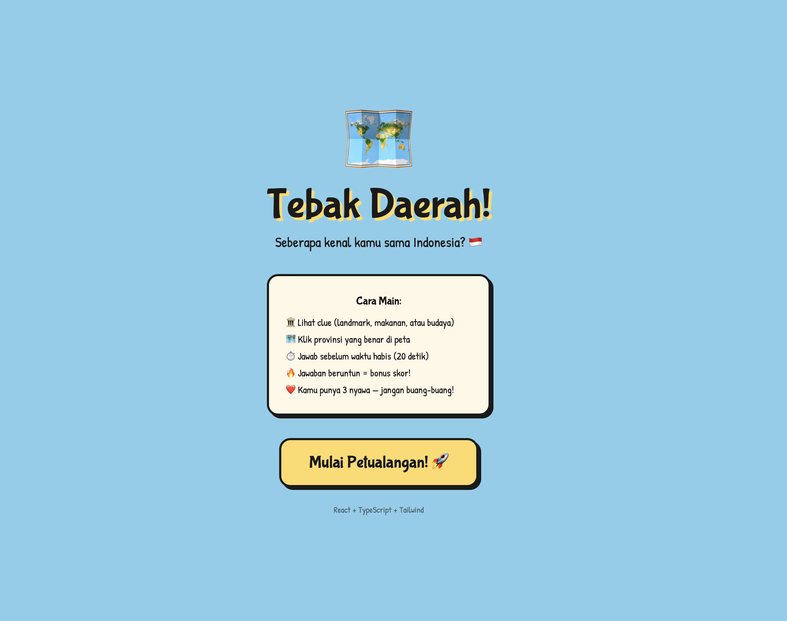
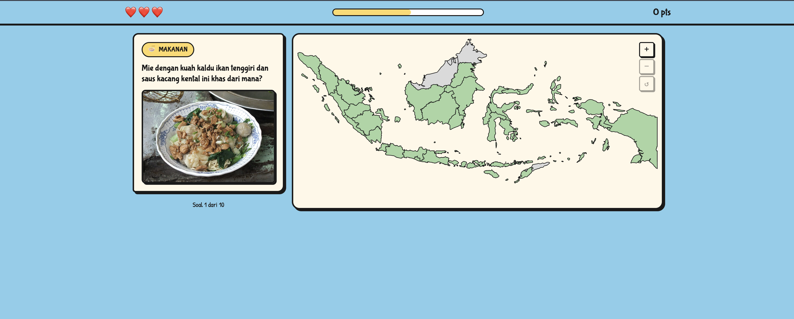
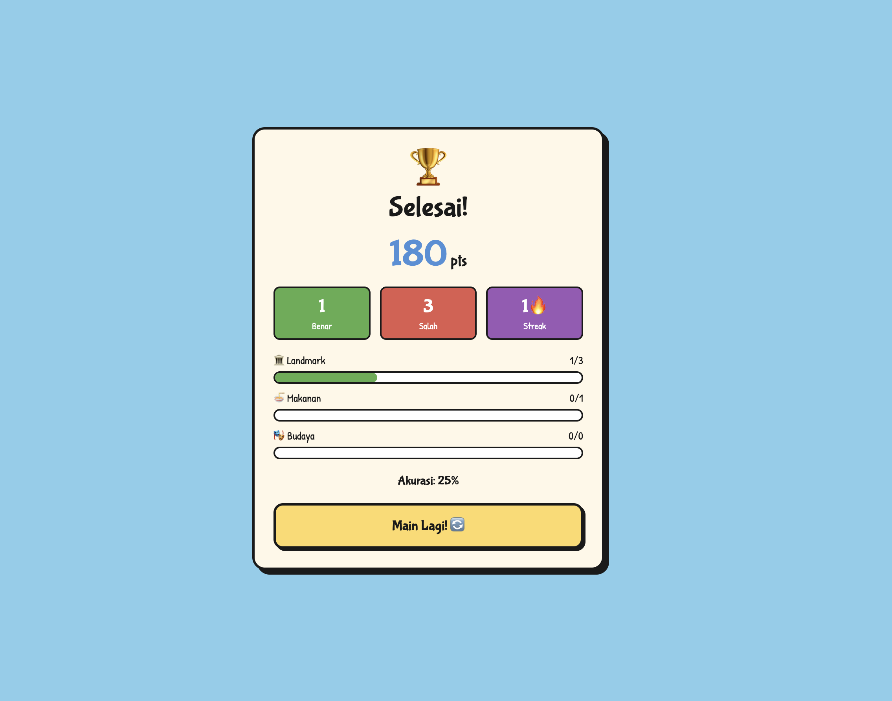

<div align="center">

# 🗺️ Tebak Daerah

**Kuis geografi Indonesia yang seru — tebak provinsi dari petunjuk landmark, makanan, dan budaya!**

[](https://react.dev)
[](https://www.typescriptlang.org)
[](https://vitejs.dev)
[](https://tailwindcss.com)

</div>

---

## 📸 Screenshots

**🏠 Layar Menu**


**🎮 Jawab Kuis**


**🏆 Hasil Akhir**


> 💡 Untuk menambahkan screenshot: buat folder `docs/screenshots/` lalu letakkan file `menu.png`, `gameplay.png`, dan `results.png` di sana.

---

## 🎯 Tentang Game

**Tebak Daerah** adalah kuis interaktif yang menantangmu mengenali **38 provinsi Indonesia** berdasarkan foto dan petunjuk.
Klik provinsi yang tepat di peta SVG interaktif sebelum waktu habis!

Cocok untuk semua umur — sambil main, sambil belajar geografi dan budaya Nusantara. 🇮🇩

---

## ✨ Fitur

| Fitur | Keterangan |
|---|---|
| 🗺️ **Peta Interaktif** | Klik langsung di peta SVG Indonesia, zoom in/out, dan drag untuk geser |
| 📚 **82 Soal** | Tersebar di 3 kategori: Landmark, Makanan, dan Budaya |
| ⏱️ **Timer per Soal** | 20 detik per soal — makin cepat menjawab, makin besar bonus poin |
| 🔥 **Sistem Streak** | Jawab beruntun untuk menggandakan poin hingga 2× |
| ❤️ **3 Nyawa** | Salah 3 kali = game over |
| 📊 **Statistik Akhir** | Lihat skor, akurasi per kategori, dan best streak setelah selesai |
| 🎭 **Feedback Animasi** | Tampilan benar/salah langsung di peta setelah menjawab |

---

## 🗂️ Kategori Soal

```
🏛️  LANDMARK  (29 soal)   →  Candi, gunung, pantai, istana, masjid bersejarah
🍜  MAKANAN   (25 soal)   →  Kuliner tradisional khas tiap daerah
🎭  BUDAYA    (28 soal)   →  Tarian, alat musik, rumah adat, upacara adat
```

---

## 🕹️ Cara Bermain

1. **Klik "Mulai Petualangan"** di layar menu
2. Baca petunjuk dan lihat gambar di **kartu soal** (kiri)
3. **Zoom dan geser peta** untuk menemukan provinsi yang dimaksud
4. **Klik provinsi** di peta → konfirmasi pilihan → lihat hasilnya
5. Kumpulkan poin sebanyak mungkin sebelum nyawa habis!

### 🏅 Sistem Poin

```
Jawaban benar          → 100 poin dasar
Bonus waktu            → +5 poin per detik tersisa
Streak beruntun        → ×1.1, ×1.2, ... hingga ×2.0
```

---

## 🚀 Menjalankan Proyek

### Prasyarat

- Node.js 18+
- npm atau pnpm

### Instalasi

```bash
# Clone repositori
git clone https://github.com/username/tebak-daerah.git
cd tebak-daerah

# Install dependensi
npm install

# Jalankan development server
npm run dev
```

Buka `http://localhost:5173` di browser.

### Build Produksi

```bash
npm run build
npm run preview
```

---

## 🛠️ Tech Stack

| Teknologi | Kegunaan |
|---|---|
| **React 19** | UI framework dengan hooks |
| **TypeScript** | Type safety di seluruh codebase |
| **Vite** | Build tool dan dev server |
| **Tailwind CSS** | Styling utility-first |
| **Framer Motion** | Animasi transisi dan feedback |
| **Howler.js** | Efek suara |
| **SVG Indonesia** | Peta interaktif dengan 38 path provinsi |

---

## 📁 Struktur Proyek

```
src/
├── assets/
│   ├── map/           # SVG peta Indonesia
│   └── sounds/        # Efek suara
├── components/
│   ├── IndonesiaMap   # Peta interaktif (zoom, pan, klik)
│   ├── ClueCard       # Kartu soal dengan gambar
│   ├── GameHUD        # Timer, nyawa, skor, streak
│   ├── FeedbackOverlay# Tampilan benar/salah
│   ├── SummaryScreen  # Hasil akhir game
│   └── MenuScreen     # Layar utama
├── data/
│   └── questions.ts   # 82 soal + gambar + fun fact
├── hooks/
│   ├── useGameState   # Logika game dengan useReducer
│   └── useTimer       # Countdown timer
└── types/
    └── game.ts        # TypeScript types & konstanta
```

---

## 🤝 Kontribusi

Punya ide soal baru, koreksi fakta, atau mau tambah fitur? Kontribusi sangat disambut!

1. Fork repositori ini
2. Buat branch baru: `git checkout -b fitur/nama-fitur`
3. Commit perubahan: `git commit -m "feat: tambah fitur baru"`
4. Push dan buat Pull Request

---

## 📜 Lisensi

MIT License — bebas digunakan dan dimodifikasi.

---

<div align="center">

Dibuat dengan ❤️ untuk memperkenalkan kekayaan Nusantara kepada semua orang.

**Selamat bermain dan selamat belajar! 🌟**

</div>
